# Exercises :pencil:

**In this workshop, we will not pay attention to design issues so before you start coding, do the followings two steps :**

- Unzip the `assets.zip` file and move the **styles** and **assets** folders into `workshop-reactjs-app/src/`

- Then, in the file `workshop-reactjs-app/src/index.js` add the following line:
```javascript
import "./styles/index.scss";
```

## Task 0

**Not mandatory:**
- Install Plug in Simple React snippets (Vscode)
- Install Reactjs code snippets (Vscode)

**Mandatory:**
- Add a directory named `components` in `src`
- Add a directory named `pages` in `src`

## Task 1

In `App.js`, remove all the code and create a simple component named `App` that just print "Hello React" on your web browser

*It should look like this:*
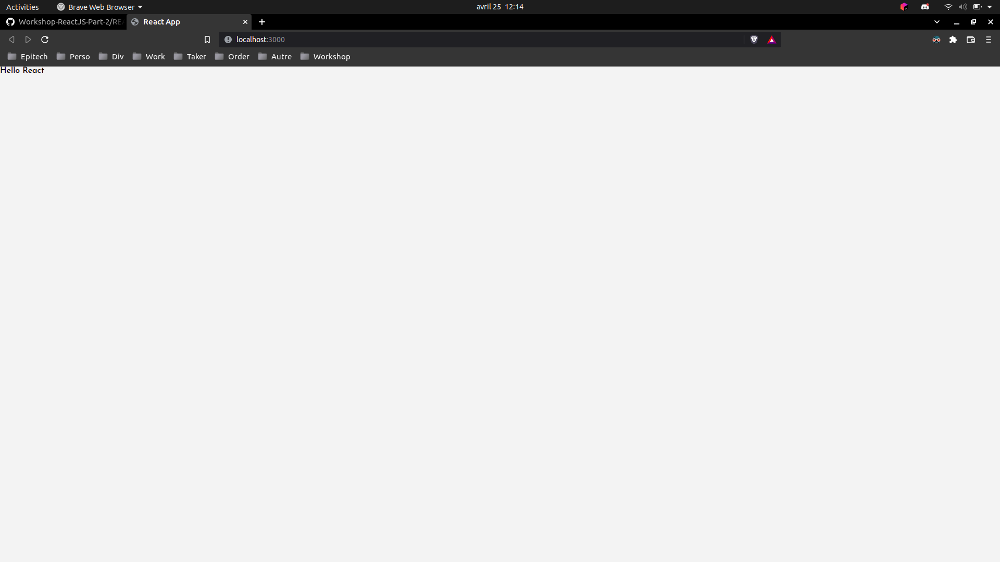

## Task 2

**It is from now on that the serious things begin ! Here you are going to create the two pages that your website will contain.**

In the folder `pages`:
- Create a file named `Home.js` and create the component `Home` that print with the HTML title tag "Home" on your web browser
- Create a file named `About.js` and create the component `About` that print with the HTML title tag "About" and some *Lorem ipsum* texts with the HTML paragraph tag on your web browser

Add those two components in `App.js`

*It should look like this:*
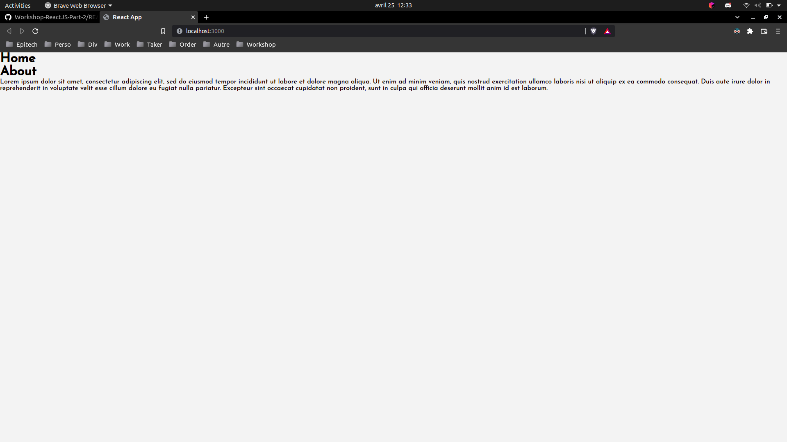

## Task 3

**Now, you are going to link the two pages created in the previous step to some URL address**

In `App.js`, add this line:
```javascript
import { BrowserRouter, Routes, Route } from "react-router-dom";
```

Use BrowserRouter, Routes and Route components imported previously and create two routes:

- One route `"/"` that will render the `Home` component
- One route `"/about"` that will render the `About` component

:bulb: **[Hint](https://reactrouter.com/docs/en/v6/getting-started/installation)**

Now, when you hit `http://localhost:3000/` you should see this:
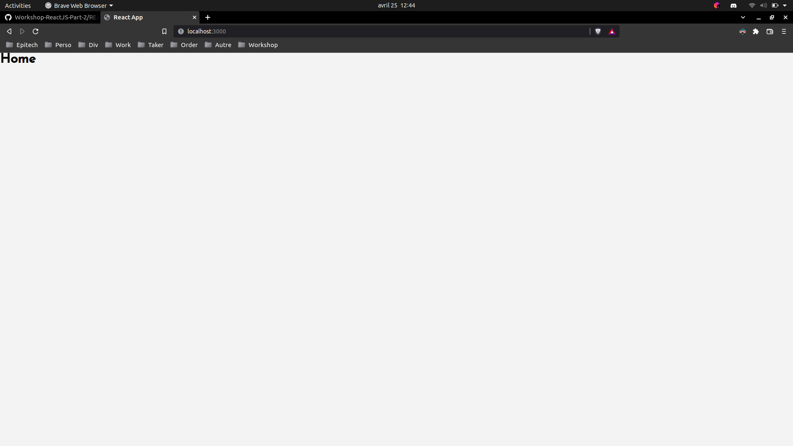

And if you hit `http://localhost:3000/about` it should look like this:
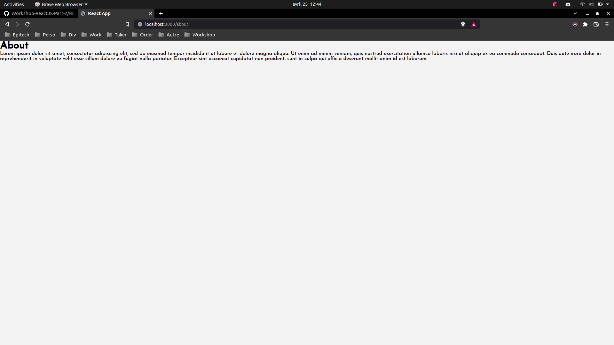

## Task 4

**Now, you are going to create your first component! Here, we want to define links you can click on to access the two roots previously defined**

In the `components` folder:

- Create a file named `Navigation.js` and create the component `Navigation`

- Add this line:
```javascript
import { NavLink } from "react-router-dom";
```

:warning: *Everything you are going to add inside the return function of your component has to be encapsulated between a HTML div tag with the class name `navigation` and a HTML unordered list tag*

```javascript
function Navigation() {
    return (
      <div className="navigation">
          <ul>


          /*Your code*/


          </ul>
      </div>
    );
}
```

- Use the `Navlinks` component to create the links to your `Home` and `About` pages

:bulb: **[Hint](https://v5.reactrouter.com/web/api/NavLink)**

- Then place your `Navigation` component just created in your `Home` and `About` components

*It should look like this:*
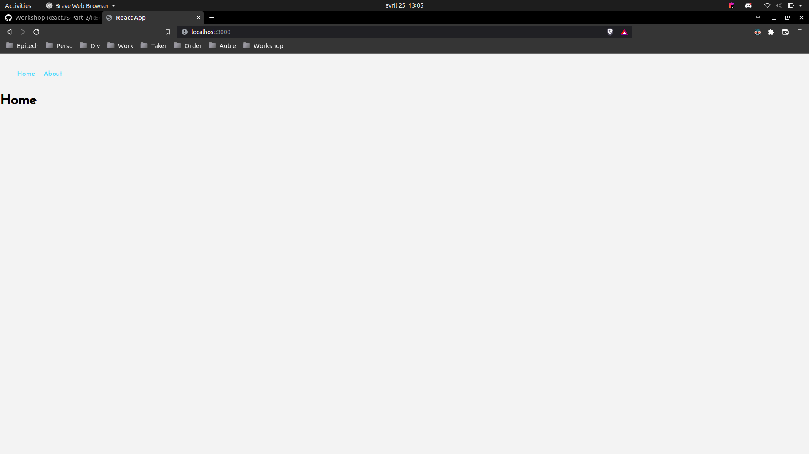

## Task 5

**Now its time to add some images**

In the `components` folder:

- Create a file named `Logo.js` and create the component `Logo`

:warning: *Everything you are going to add inside the return function of your component has to be encapsulated between a HTML div tag with the class name `logo`*

```javascript
function Logo() {
    return (
      <div className="logo">


          /*Your code*/


      </div>
    );
}
```

- Use the HTML image tag to display the `logo192.png` on your web browser

*It should look like this:*
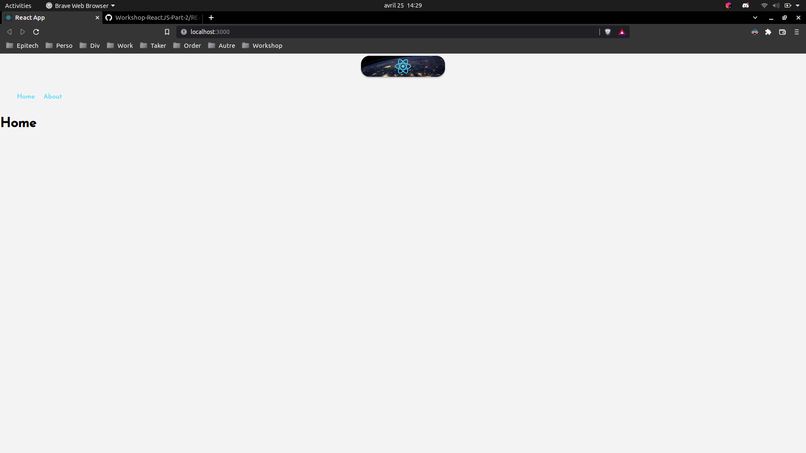

## Task 6

**Now you are going to discover a very useful tool in React : [Hooks](https://reactjs.org/docs/hooks-intro.html) ! Let's start with the `useEffect` Hook**

Before that, in the `components` folder:

- Create a file named `Countries.js` and create the component `Countries` that print with the HTML title tag "COUNTRIES" on your web browser

:warning: *Everything you are going to add inside the return function of your component has to be encapsulated between a HTML div tag with the class name `countries`*

```javascript
function Countries() {
    return (
      <div className="countries">


          /*Your code*/


      </div>
    );
}
```

- Add the `Countries` component in the `Home` component

Now, still in the `Coutries.js` file add this line:
```javascript
import { useEffect } from "react";
```

- To make sure you understand the concept of `useEffect`, you will have to print "Hello React" on your web browser console everytime you refresh the internet page

:bulb: **[Hint](https://fr.reactjs.org/docs/hooks-effect.html)**

*It should look like this (screen of the console):*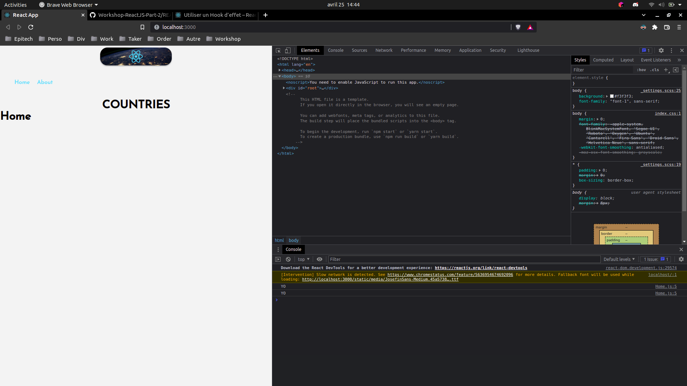

**Your now a master of React Hooks!** :laughing:

## Task 7

**This is were it gets rough. Now you want to display data that is not stored locally. So you are going to fetch data from an existing API: [The REST Countries API](https://restcountries.com/)**

In the `Coutries.js` file add this line:
```javascript
import axios from 'axios';
```

Using the `useEffect` Hook and `axios`, do a GET request from this API link `https://restcountries.com/v3.1/all` and print the result in your web browser console everytime you refresh the internet page.

:warning: *Maybe the keyword data can be usefull*

:bulb: **[Hint](https://axios-http.com/docs/intro)**

*It should look like this (screen of the console):*
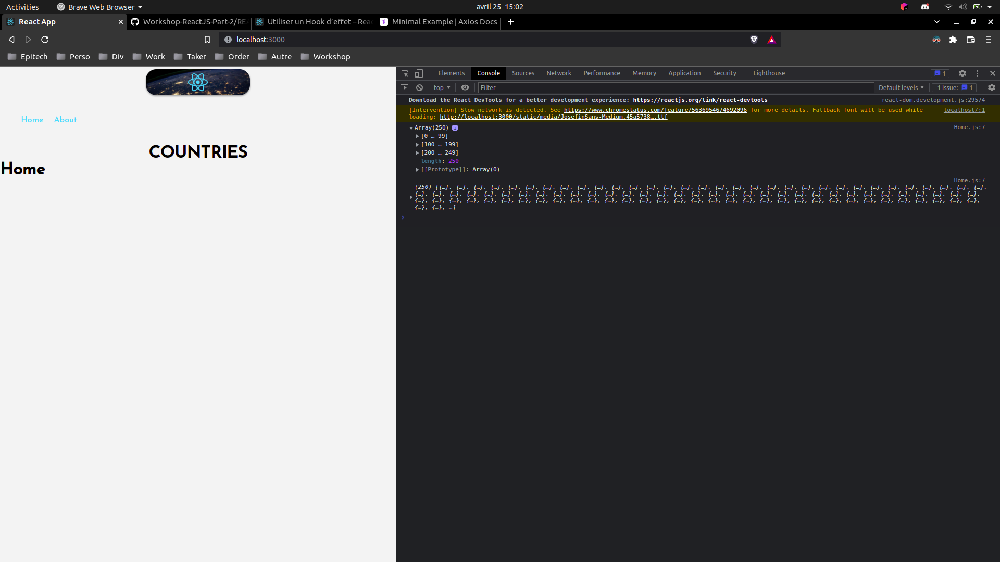

## Task 8

**Now you are going to discover another Hook: `useState`**

In the `Countries.js` file, add this line:
```javascript
import { useState } from 'react';
```

Still in the `Coutries.js` with the use of `useState`, `useEffect` and `axios`, store the data that you previously printed in your web browser console into a const variable named `data`.

Again, everytime your refresh your the internet page, the fetched data must be stored in your const variable `data`.

:question: *You may ask: How can I modify a const variable? This is where [useState Hook](https://fr.reactjs.org/docs/hooks-state.html) goes into action : )*

*It should look like this (screen of the console):*
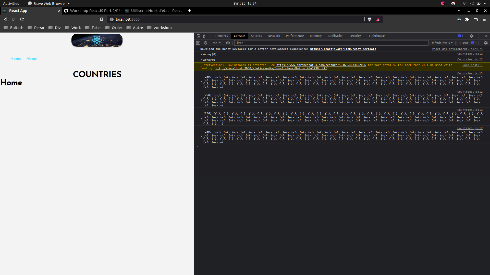

## Task 9

**Now you are going to explore a very useful tool: [map functions](https://en.reactjs.org/docs/lists-and-keys.html)**

*Your `data` variable is now containing an array of countries and their information.*

- In the `Countries.js` file, display all the names of the countries by looping on this array using the `map` function in a HTML unordered list tag

:warning: *Pay attention to your data's architecture in order to access the countries name*

*It should look like this:*
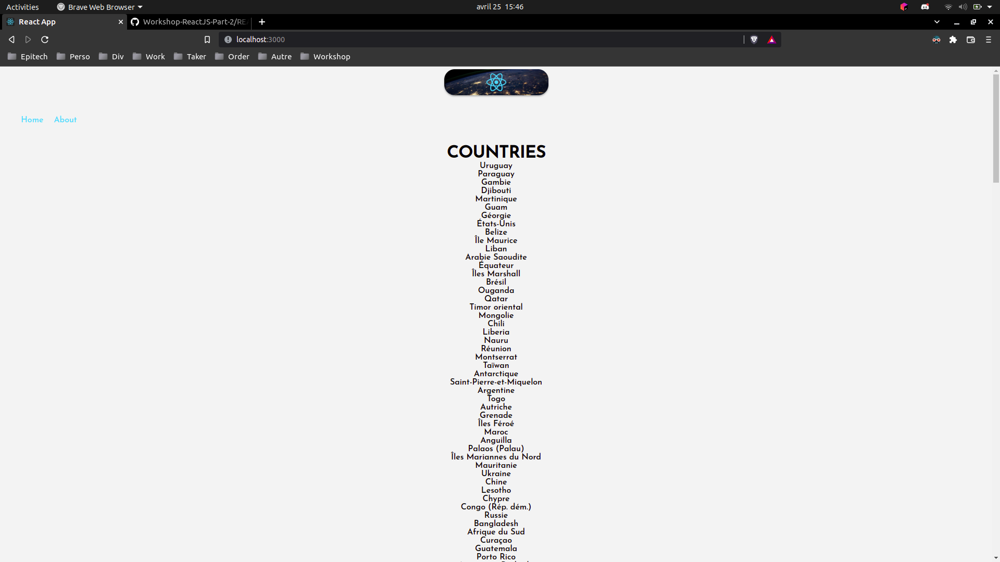

## Task 10

**As you may have noticed, in React, components are functions so they also can handle parameters. They are called [props](https://en.reactjs.org/docs/components-and-props.html)**

Now, still looping on your data's array with the `map` function, print the countries information in a `Card` component that you will create by following the instructions underneath. You will have to pass the countries information in the card `props`

In the `components` folder:

- Create a file named `Card.js` and create the component `Card`


```javascript
function Card(/*Code*/) {
    return (
      <li className="card">
        
      <div className="infos">
        <h2>{/*Code*/}</h2>
        <h4>{/*Code*/}</h4>
        <p>{/*Code*/}</p>
      </div>
      </li>
    );
}
```

*It should look like this:*
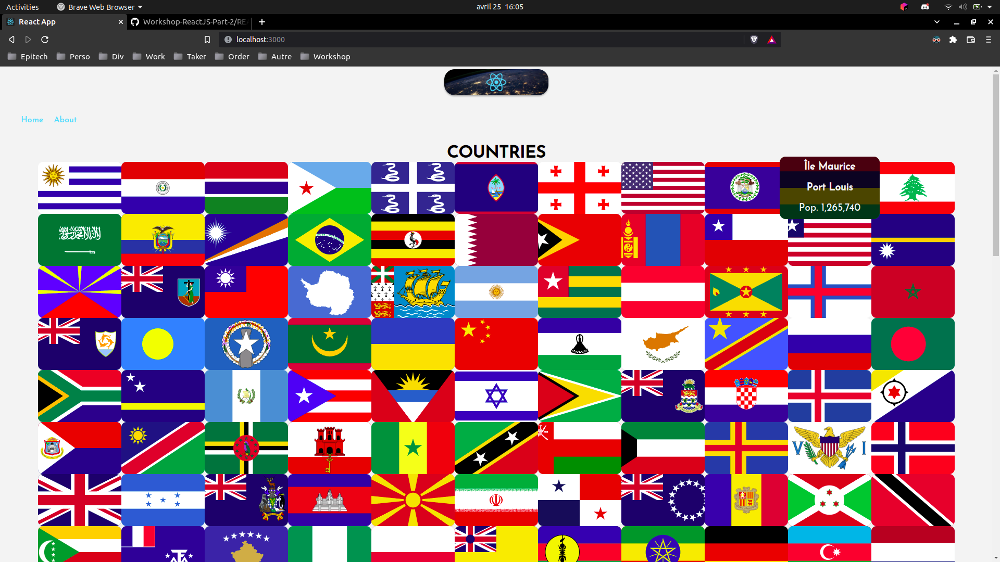

## Task 11 (Bonus)

**You can choose the number of countries that will be printed**

:bulb: **Hint: `slice`**

---

<div align="center">

<a href="https://github.com/juniorconseiltaker" target="_blank"></a>

</div>